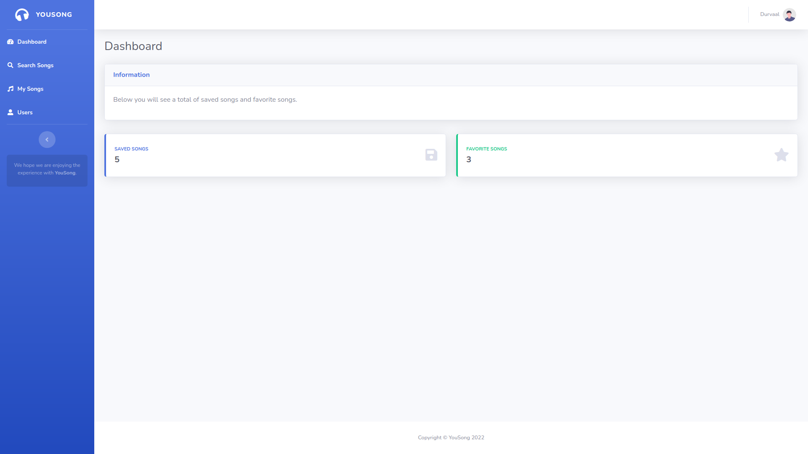

# YouSong

## Save your favorite songs to listen later!

> Com o YouSong você pode listar, ouvir, salvar e favoritar os previews das suas músicas favoritas do Deezer. Além disso, poderá contar com um controle de usuários, com isso, você pode criar vários perfis, cada perfil para um estilo musical diferente. O que acha?! 😄

### O que o YouSong faz?

O YouSong permite que o usuário possa criar uma conta, e após o login, o usuário irá se deparar com um painel administrativo com algumas opções:

- **Dashboard**: o usuário terá um relatório das suas músicas que foram salvas e favoritadas;
- **Search Songs**: o usuário poderá buscar por diversas rádios do Deezer, e para cada rádio escolhida poderá salvar quantas músicas quiser, além de poder escutar antes de salvá-las;
- **My Songs**: o usuário poderá listar as músicas salvas, ouvi-las e também favoritar quantas quiser. E caso exista uma música que não goste mais, o usuário poderá removê-la.
- **Users**: o usuário poderá listar todos os perfis criados, além disso, é possível editar o nome ou excluir o perfil. Mas cuidado hein?! Ao excluir o perfil, todas as músicas associadas ao perfil também serão excluídas.

> Preview do Painel, logo acima.

## Quais recursos extras o YouSong utiliza?

- API pública do Deezer: https://developers.deezer.com/api/;
  - Utilizada para listar as rádios e as músicas na página de **Search Songs**.
- Template bootstrap: https://startbootstrap.com/theme/sb-admin-2;
- Framework VueJS: https://vuejs.org/.
  -  Utilizado também para controlar o consumo da API do Deezer.

## O que o YouSong necessita para rodar?

Além de possuir a configuração local instalada com Eclipse, Apache Tomcat e Java, você precisará do MySQL para criar a estrutura inicial do banco de dados, o script de criação do banco e das tabelas necessárias pode ser encontrado [aqui](script-mysql/script-mysql.sql).

## Apresentação

Assista a apresentação do projeto [aqui](https://drive.google.com/file/d/1XRk7M_TIXdEMTwWoB3_4nFJ1wSzsLGIY/view?usp=sharing).

## P.S.

A API pública do Deezer disponibiliza apenas aúdios de 30s e não a música completa, caso estranhe 😄.

## 🤝 Colaboradores

<table>
  <tr>
    <td align="center">
      <a href="#">
         
        
          <b>Paulo de Lima Xavier </b>
        
         
        
          <b>20190104147</b>
        
      </a>
    </td>
  </tr>
</table>

#### Obrigado por chegar até aqui! ❤️  

[⬆ Voltar ao topo](#YouSong) 